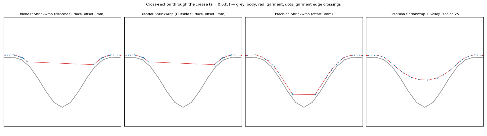

# Precision Shrinkwrap（高精度シュリンクラップ）for Blender

ぴったりした衣装・下着づくり向けの、高精度なシュリンクラップ用アドオンです。

- **谷で伸びない**：おしりの割れ目や谷間など、狭い谷で頂点が偏ったり、ポリゴンが引き伸ばされたりしません。
- **均等なオフセット**：素体から指定距離ぴったりに配置します。谷で左右の面が交差して崩れることもありません。
- **素体トポロジーの転写**：素体の面をそのまま使って衣装を作れます。
  - **サブディビ維持**：Subdivisionモディファイアを残したまま、分割後の形状がオフセット位置に来るようにケージを逆算します。
  - **適用後に完全一致**：Subdivisionを適用した後の頂点と完全に一致するメッシュを作ります（オフセット0なら誤差0）。



*おしりの割れ目を想定した谷の断面です（灰色：素体、赤：衣装）。標準のShrinkwrapでは頂点が谷の縁に溜まり、谷は1本の辺で引き伸ばされます。本アドオンでは頂点が谷の中まで均等に入ります。右端は「谷の張り」を有効にした例で、張った布のように谷の上を渡ります。*

## 動作環境

Blender 4.2 以降（4.1でも動作する想定ですが、テストしたのは4.2です）。

## インストール

1. `precision_shrinkwrap` フォルダをzipに圧縮します（zipの中に `precision_shrinkwrap/__init__.py` が入る形）。
2. Blenderで次のどちらかを行います。
   - 4.2以降：`編集 > プリファレンス > アドオン > ▼ > ディスクからインストール` でzipを選択
   - 旧来の方法：`プリファレンス > アドオン > インストール`
3. 3Dビューのサイドバー（Nキー）に **PrecisionSW** タブが追加されます。

UI言語を日本語にすると、ラベルも日本語で表示されます。

## 使い方

### A. 衣装を素体にフィットさせる（衣装をフィット）

1. **ターゲット（素体）** に素体を指定します。素体はモディファイア（Subdivisionなど）を適用した後の形状を、レストポーズで使います。
2. **オフセット** に素体から離す距離を指定します（例：2mm = 0.002m）。
3. 衣装オブジェクトを選択し、**Precision Shrinkwrap** を押します。
4. 結果は既定で新しいシェイプキー `PrecisionShrinkwrap` として保存されるので、元の形状を壊しません。直接頂点を動かしたい場合は **出力 = 直接適用** にしてください。

主な設定：

| 設定 | 内容 |
|---|---|
| 反復回数 | 投影と整列を繰り返す回数です。増やすほど谷がきれいになりますが、時間がかかります（既定30） |
| リラックス | 面に沿って頂点を整列させる強さです。谷に頂点が溜まるのを防ぎます |
| 頂点分布 | **元の流れを維持**：元のエッジフローと間隔を保ちます ／ **均等**：頂点を均等に並べ直します |
| 谷の張り | 0なら谷の奥まで沿わせます。値を上げると、張った布のように谷の上を渡ります（ショーツのおしり部分など） |
| 段階的オフセット | 大きいオフセットから始めて少しずつ縮めます。頂点が正しい側から谷に入るようになります（開始値0 = 自動） |
| サブディビジョン対応 | 衣装にSubdivisionがある場合、分割後の形状をフィットさせ、そうなるケージを逆算します |
| 影響グループ | ウェイト0の頂点は固定されます（ウエストのゴム部分などに） |
| オフセット用グループ | 頂点ごとにオフセット量を変えます（ウェイト × オフセット） |

**オフセット確認** ボタンを押すと、選択中の衣装と素体との距離（最小・平均・最大）、およびめり込んでいる頂点の数が表示されます。

### B. 素体トポロジー転写（素体の面から衣装を作る）

1. **ターゲット** に素体を指定します。
2. **範囲** を次のどれかで指定します。
   - **選択面**：素体を編集モードにして、下着にしたい範囲の面を選択します
   - **頂点グループ**：全頂点がグループに含まれる（ウェイト0.5以上の）面を使います
   - **近くのオブジェクト**：既存の衣装に近い面を使います
   - **すべて**：メッシュ全体を使います
3. **モード** を選びます。
   - **サブディビ維持**：素体のケージ面とモディファイア一式（Subdivision、Armatureなど）をコピーします。分割後の形状がオフセット位置に来るよう、ケージの頂点を逆算します。シェイプキーとウェイトも引き継ぎます。
   - **適用後に完全一致**：Subdivisionを適用した後の素体メッシュをそのままコピーします。オフセット0なら、分割後の素体と頂点位置が完全に一致します（誤差0）。オフセットを指定すると、各頂点が対応する素体頂点の真上に来たまま、ぴったりオフセットした位置に配置されます。Armatureモディファイアとウェイトもコピーされます。
4. **トポロジー転写** を押すと `素体名_Wear` が作られます。

おすすめの流れ：スカルプトなどで作った衣装を、素体のトポロジーに置き換えたい場合

1. 範囲を **近くのオブジェクト**（既存の衣装）にして、オフセット0でトポロジー転写します。
2. できたメッシュを選択し、**ターゲット = 既存の衣装**、オフセット0で「衣装をフィット」を実行します。

これで、素体と同じトポロジーのまま衣装の形状になります。

## 仕組み

1. **オフセット面への投影**：「最近点 + 法線 × オフセット」ではなく、素体からの距離がちょうどオフセットになる面（距離場の等値面）へ投影します。法線方向にずらすと谷の両側が交差しますが、等値面は谷を自然に埋めるため、交差しません。
2. **接線方向のリラックス**：投影を繰り返すあいだに、表面に沿って頂点を整列し直します。最近点投影では頂点が谷の縁に溜まりますが、これを元の間隔（または均等な間隔）に戻します。
3. **段階的オフセット**：谷が埋まるほど大きいオフセットで一度きれいに包んでから、オフセットを少しずつ縮めて谷に下ろします。
4. **谷の張り**：メッシュを自由に平滑化してから、オフセット面の外側へだけ押し出します。凸部はオフセット面に戻り、谷は布のように橋渡しされます。
5. **サブディビジョンの逆算**：Subdivisionは、ケージ座標に対する線形写像 `S` です。トポロジーから分かるサポート範囲と数回の評価から `S` を復元し、分割後の全頂点について最小二乗でケージを解きます。さらに、オフセットより内側に入った頂点がなくなるまで目標を押し上げます。Mirrorモディファイア（クリッピング／マージ）にも対応しています。

## 制限事項

- フィットはレストポーズで行います（計算中はArmatureなどの変形モディファイアを一時的に無効にします）。
- シェイプキーを持つメッシュでは、Basisの形状を基準にフィットします。「直接適用」では、既存のシェイプキーにも同じ移動量を加えます。
- サブディビ衣装のケージが谷の幅より粗い場合、ケージでは谷を表現しきれません。この場合はめり込み防止を優先し、谷の周辺がオフセットより少し浮くことがあります（テストでは最大1.5mm程度）。
- Mirrorモディファイアの「ミラーオブジェクト」や「二等分」を使っている場合、サブディビの最小二乗解法は使われず、ケージの角頂点だけを合わせる方式になります。
- Multiresには対応していません。

## テスト

Blender本体、またはPyPIの `bpy` モジュールでヘッドレス実行できます。

```sh
blender -b --factory-startup -P tests/run_tests.py
# または
pip install bpy==4.2.0 && python tests/run_tests.py
```

テストでは、オフセット誤差、めり込み、標準Shrinkwrapとの伸び比較、サブディビ衣装（粗い／細かいケージ、Mirror）、転写の完全一致、サブディビ維持転写を検証します。
