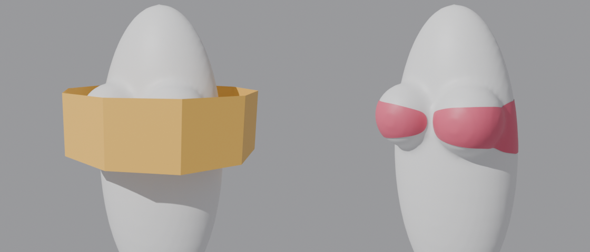

# Precision Shrinkwrap（高精度シュリンクラップ）for Blender

ぴったりした衣装・下着づくり向けの、高精度なシュリンクラップ用アドオンです。

- **谷で伸びない**：おしりの割れ目や谷間など、狭い谷で頂点が偏ったり、ポリゴンが引き伸ばされたりしません。
- **均等なオフセット**：素体から指定距離ぴったりに配置します。谷で左右の面が交差して崩れることもありません。
- **素体トポロジーの転写**：素体の面をそのまま使って衣装を作れます。
  - **サブディビ維持**：Subdivisionモディファイアを残したまま、分割後の形状がオフセット位置に来るようにケージを逆算します。
  - **適用後に完全一致**：Subdivisionを適用した後の頂点と完全に一致するメッシュを作ります（オフセット0なら誤差0）。

- **ラフケージから完全フィット**：数枚の面でざっくり作ったケージを置くだけで、素体に完全一致する衣装（または均等オフセットした衣装）を自動で作ります。
- **ミラー対応**：ミラーモディファイア付きの素体・衣装でも、中心の頂点がミラー面から外れません。適用モードでも、半身とミラーモディファイアの形で出力できます。


*おしりの割れ目を想定した谷の断面です（灰色：素体、赤：衣装）。標準のShrinkwrapでは頂点が谷の縁に溜まり、谷は1本の辺で引き伸ばされます。本アドオンでは頂点が谷の中まで均等に入ります。右端は「谷の張り」を有効にした例で、張った布のように谷の上を渡ります。*

## 動作環境

Blender 4.2 以降（4.1でも動作する想定ですが、テストしたのは4.2です）。

## インストール

1. `precision_shrinkwrap` フォルダをzipに圧縮します（zipの中に `precision_shrinkwrap/__init__.py` が入る形）。
2. Blenderで次のどちらかを行います。
   - 4.2以降：`編集 > プリファレンス > アドオン > ▼ > ディスクからインストール` でzipを選択
   - 旧来の方法：`プリファレンス > アドオン > インストール`
3. 3Dビューのサイドバー（Nキー）に **PrecisionSW** タブが追加されます。

UI言語を日本語にすると、ラベルも日本語で表示されます。

## 使い方

### ラフケージから完全フィット（おすすめ）



*左：素体から離して置いた、雑な帯状ケージ（10×3面）。右：実行後の結果。素体と同じトポロジーで、素体から1mmのところにぴったり沿っています。*

1. **ターゲット（素体）** を指定します。
2. 素体のまわりに、衣装を作りたい範囲を覆うケージをざっくり置きます。数枚の面の筒や箱で十分です。素体から離れていてもかまいません。ミラーモディファイア付きの半分のケージでもOKです。
3. ケージを選択して、**ラフケージから完全フィット** を押します。

ケージは「どこに衣装を作るか」の指定にだけ使います。衣装そのものは素体のトポロジーで作るので、雑なケージでも素体に完全に一致します。

- ケージのマテリアルを引き継ぎ、ケージは非表示になります（**ケージを隠す**）。
- 出力の設定（サブディビ維持／適用後に完全一致、ミラーを維持、素体にフィット、オフセット）は「素体トポロジー転写」と共通です。
- **カバー率**：素体の面がケージにどれだけ覆われていれば範囲に含めるかを指定します。
- **境界をなめらかに**：素体の面単位で選ぶと縁がギザギザになるので、縁の頂点を素体に沿ってならします。0にすると、縁も素体の頂点と完全一致します。
- **谷の張り**：値を上げると、谷間を少し橋渡しします。ただし深い谷間を完全に渡すほどの強さはまだありません（下の「制限事項」を参照）。

なぜ雑なケージをそのまま「衣装をフィット」してはいけないのか：頂点が少ないメッシュは、頂点を素体の表面に乗せても、頂点どうしをつなぐ平らな面が胸などの曲面を突き抜けてしまいます。そのため「衣装をフィット」では、素体よりずっと粗いメッシュを実行すると警告を出すようにしました。

### A. 衣装を素体にフィットさせる（衣装をフィット）

1. **ターゲット（素体）** に素体を指定します。素体はモディファイア（Subdivisionなど）を適用した後の形状を、レストポーズで使います。
2. **オフセット** に素体から離す距離を指定します（例：2mm = 0.002m）。
3. 衣装オブジェクトを選択し、**Precision Shrinkwrap** を押します。
4. 結果は既定で新しいシェイプキー `PrecisionShrinkwrap` として保存されるので、元の形状を壊しません。直接頂点を動かしたい場合は **出力 = 直接適用** にしてください。

主な設定：

| 設定 | 内容 |
|---|---|
| 反復回数 | 投影と整列を繰り返す回数です。増やすほど谷がきれいになりますが、時間がかかります（既定30） |
| リラックス | 面に沿って頂点を整列させる強さです。谷に頂点が溜まるのを防ぎます |
| 頂点分布 | **元の流れを維持**：元のエッジフローと間隔を保ちます ／ **均等**：頂点を均等に並べ直します |
| 谷の張り | 0なら谷の奥まで沿わせます。値を上げると、張った布のように谷の上を渡ります（ショーツのおしり部分など） |
| 段階的オフセット | 大きいオフセットから始めて少しずつ縮めます。頂点が正しい側から谷に入るようになります（開始値0 = 自動） |
| サブディビジョン対応 | 衣装にSubdivisionがある場合、分割後の形状をフィットさせ、そうなるケージを逆算します |
| 影響グループ | ウェイト0の頂点は固定されます（ウエストのゴム部分などに） |
| オフセット用グループ | 頂点ごとにオフセット量を変えます（ウェイト × オフセット） |

**オフセット確認** ボタンを押すと、選択中の衣装と素体との距離（最小・平均・最大）、およびめり込んでいる頂点の数が表示されます。

### B. 素体トポロジー転写（素体の面から衣装を作る）

1. **ターゲット** に素体を指定します。
2. **範囲** を次のどれかで指定します。
   - **選択面**：素体を編集モードにして、下着にしたい範囲の面を選択します
   - **頂点グループ**：全頂点がグループに含まれる（ウェイト0.5以上の）面を使います
   - **ラフケージ**：雑なケージが覆っている面を使います（上の「ラフケージから完全フィット」と同じ判定です）
   - **近くのオブジェクト**：既存の衣装に近い面を使います
   - **すべて**：メッシュ全体を使います
3. **モード** を選びます。
   - **サブディビ維持**：素体のケージ面とモディファイア一式（Subdivision、Armatureなど）をコピーします。分割後の形状がオフセット位置に来るよう、ケージの頂点を逆算します。シェイプキーとウェイトも引き継ぎます。
   - **適用後に完全一致**：Subdivisionを適用した後の素体メッシュをそのままコピーします。素体にミラーモディファイアがある場合、**ミラーを維持** がオンなら、半身＋ミラーモディファイアで出力します（ミラー適用後の形は完全一致のままです）。オフセット0なら、分割後の素体と頂点位置が完全に一致します（誤差0）。オフセットを指定すると、各頂点が対応する素体頂点の真上に来たまま、ぴったりオフセットした位置に配置されます。Armatureモディファイアとウェイトもコピーされます。
4. **素体にフィット** を選びます。
   - オン：上記のとおり、素体から **オフセット** の距離に配置します。
   - オフ：シュリンクラップもオフセットもせず、トポロジーをそのままコピーするだけです。オフセット値は無視されます。サブディビ維持モードではケージが素体のケージと完全に一致し、適用モードでは分割後の素体の頂点と完全に一致します。ゆったりした服など、あとで自分で形を作りたいときに使います。
5. **トポロジー転写** を押すと `素体名_Wear` が作られます。

※ サブディビ維持モードで「素体にフィット」をオフにした場合、ケージは素体と同じです。ただし切り出した範囲の端（開いた縁）では、Subdivisionの境界ルールによって分割後の形が素体より少し内側に縮みます。オンにすると、この縮みもケージの逆算で補正されます。

おすすめの流れ：スカルプトなどで作った衣装（ゆったりした服も含む）を、素体のトポロジーに置き換えたい場合

1. **素体にフィット** をオフにしてトポロジー転写します。範囲は、衣装が体から離れている場合は **選択面**、体に近い場合は **近くのオブジェクト** が便利です。
2. できたメッシュを選択し、**ターゲット = 既存の衣装**、オフセット0で「衣装をフィット」を実行します。

これで、素体と同じトポロジーのまま衣装の形状になります。

## 仕組み

1. **オフセット面への投影**：「最近点 + 法線 × オフセット」ではなく、素体からの距離がちょうどオフセットになる面（距離場の等値面）へ投影します。法線方向にずらすと谷の両側が交差しますが、等値面は谷を自然に埋めるため、交差しません。
2. **接線方向のリラックス**：投影を繰り返すあいだに、表面に沿って頂点を整列し直します。最近点投影では頂点が谷の縁に溜まりますが、これを元の間隔（または均等な間隔）に戻します。
3. **段階的オフセット**：谷が埋まるほど大きいオフセットで一度きれいに包んでから、オフセットを少しずつ縮めて谷に下ろします。
4. **谷の張り**：メッシュを自由に平滑化してから、オフセット面の外側へだけ押し出します。凸部はオフセット面に戻り、谷は布のように橋渡しされます。
5. **サブディビジョンの逆算**：Subdivisionは、ケージ座標に対する線形写像 `S` です。トポロジーから分かるサポート範囲と数回の評価から `S` を復元し、分割後の全頂点について最小二乗でケージを解きます。さらに、オフセットより内側に入った頂点がなくなるまで目標を押し上げます。Mirrorモディファイア（クリッピング／マージ）にも対応しています。

## 制限事項

- フィットはレストポーズで行います（計算中はArmatureなどの変形モディファイアを一時的に無効にします）。
- シェイプキーを持つメッシュでは、Basisの形状を基準にフィットします。「直接適用」では、既存のシェイプキーにも同じ移動量を加えます。
- サブディビ衣装のケージが谷の幅より粗い場合、ケージでは谷を表現しきれません。この場合はめり込み防止を優先し、谷の周辺がオフセットより少し浮くことがあります（テストでは最大1.5mm程度）。
- Mirrorモディファイアの「ミラーオブジェクト」や「二等分」を使っている場合、サブディビの最小二乗解法は使われず、ケージの角頂点だけを合わせる方式になります。
- Multiresには対応していません。
- 「谷の張り」は、浅い谷（おしりの割れ目など）は十分に橋渡しします。ただし深さ3cmほどの深い谷間では、テストで最大1cm程度しか浮きません。深い谷間を完全にまたぐブラのような形状は、まだ手作業での調整が必要です。
- 「ラフケージ」で範囲を選んだ場合、「境界をなめらかに」がオンだと、縁の頂点は素体の頂点からずれます（内側はすべて一致します）。

## テスト

Blender本体、またはPyPIの `bpy` モジュールでヘッドレス実行できます。

```sh
blender -b --factory-startup -P tests/run_tests.py
# または
pip install bpy==4.2.0 && python tests/run_tests.py
```

テストでは、オフセット誤差、めり込み、標準Shrinkwrapとの伸び比較、サブディビ衣装（粗い／細かいケージ、Mirror）、転写の完全一致、サブディビ維持転写、フィットなしのコピー、ラフケージ（全身・ミラー半身 × 両モード）、エラーメッセージを検証します。
